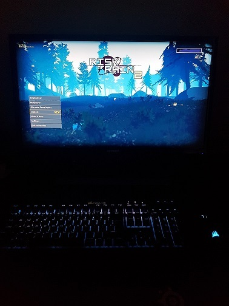
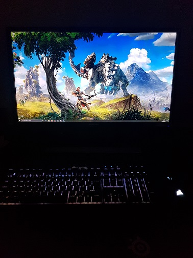

{
 "cells": [
  {
   "cell_type": "markdown",
   "metadata": {},
   "source": [
    "# About\n",
    "\n",
    "I thought it would be neat to get the RGB LEDs in my Corsair keyboard and mouse to copy or mirror what is on-screen (a bit like Sony Bravia TVs that have a backlight that changes according to what's on-screen). \n",
    "\n",
    "Turns out Corsair have a python SDK for iCue (https://github.com/CorsairOfficial/cue-sdk-python) so this is my first attempt. I'm surprised with how well it worked! \n",
    "\n",
    "I have an MSI motherboard and want to eventually apply the same principle, but I can only find the MSI Mystic Light SDK in C++ or C#. I'm not familiar with either, but I'd hope to be able to handle the main computation in python and import/export led values. Tbc, will be a while before I look into that. "
   ]
  },
  {
   "cell_type": "markdown",
   "metadata": {},
   "source": [
    "\n",
    "\n",
    ""
   ]
  },
  {
   "cell_type": "code",
   "execution_count": null,
   "metadata": {},
   "outputs": [],
   "source": []
  }
 ],
 "metadata": {
  "kernelspec": {
   "display_name": "Python 3",
   "language": "python",
   "name": "python3"
  },
  "language_info": {
   "codemirror_mode": {
    "name": "ipython",
    "version": 3
   },
   "file_extension": ".py",
   "mimetype": "text/x-python",
   "name": "python",
   "nbconvert_exporter": "python",
   "pygments_lexer": "ipython3",
   "version": "3.8.5"
  }
 },
 "nbformat": 4,
 "nbformat_minor": 4
}
